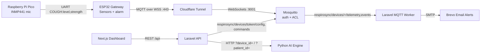

# 🫁 RespiroSync: AI-Powered Asthma Monitoring System


 
 
 


**RespiroSync** is a professional, full-stack IoT medical telemetry platform. It uses a dual-processor device (ESP32 + Raspberry Pi Pico) for sound-based cough detection and environmental monitoring, and sends data over authenticated, encrypted MQTT to a Next.js / Laravel dashboard.

---

## 📸 Dashboard Interface

The cloud platform features a responsive, dark-mode native dashboard designed for guardians and medical professionals to monitor patient vitals, configure hardware thresholds, and generate PDF analytics reports.


---

## 🚀 Key Features & Technologies

| Feature | Technology Used | Description |
|---|---|---|
| **Acoustic cough detection** | `Raspberry Pi Pico` | INMP441 I2S microphone. A sound-level heuristic flags short loud bursts and reports a 0–1 *detection strength*. It cannot yet tell a cough from other loud sounds (see `hardware/README.md`, Phase 2). |
| **Environmental Telemetry** | `ESP32` | DHT22 (temp/humidity), MQ-135 (gas, estimated CO₂-equivalent ppm, self-calibrated), Sharp GP2Y1010AU0F (dust, self-calibrated estimate). Sent every 3 s, smoothed over ~12 s. Local passive-buzzer/LED alarm when a reading crosses its threshold, even offline. |
| **Secure IoT Transport** | `Mosquitto + Cloudflare Tunnel` | MQTT over WSS. No anonymous access; each device can only publish/subscribe under its own token (broker ACL). |
| **Predictive AI Engine** | `Python / scikit-learn` | One model per account. Stage 1: anomaly check against the room's own baseline. Stage 2 (once enough episodes are logged): logistic regression, then Random Forest, predicting an asthma-like event (rescue dose or cough cluster) in the next hour, evaluated by recall and precision on later data. Controller doses are an input, not an episode. Caregiver "false alarm" labels are excluded from training. |
| **REST API & Workers** | `Laravel 12 / PHP 8.2` | API, MQTT worker, scheduler. All data is scoped to the signed-in account. |
| **Interactive UI** | `Next.js / Tailwind CSS` | Live monitor, Sleep Mode, Command Center (thresholds sync to the device), weekly report. |
| **Alerts** | `Brevo SMTP` | Email when coughs cluster (3 in 10 min, or 2 strong detections), at most one per device per 10 minutes. Web Push is implemented server-side; the browser subscription UI is not wired yet. |
| **Identity Management** | `Laravel Sanctum` | Token auth, forgot/reset password (links expire after 60 minutes). |

---

## 🧠 System Architecture



### MQTT topics

| Topic | Direction | Payload |
|---|---|---|
| `respirosync/devices/<token>/telemetry` | device → cloud | `{"pm25_level":12.3,"temperature":29.1,"humidity":70,"mq135_level":410}` (`null` for a failed sensor) |
| `respirosync/devices/<token>/events` | device → cloud | `{"event":"cough","level":2,"confidence":0.42}` (`confidence` = Pico detection strength) |
| `respirosync/devices/<token>/config` | cloud → device (retained) | `{"pm25_threshold":35,"temperature_threshold":35,"humidity_threshold":60,"mq135_threshold":1000,"is_buzzer_muted":false}` |
| `respirosync/devices/<token>/commands` | cloud → device | `{"command":"factory_reset"}`, `buzzer_on`, `buzzer_off` |

The device connects with **client id = its 6-character token**; `mosquitto/config/acl` restricts it to its own four topics.

---

## 📁 Repository Structure

```text
asthma-monitoring-system/
├── frontend/               # Next.js application (port 3000, published on 127.0.0.1:3005)
├── backend/                # Laravel 12 API, MQTT worker, scheduler (port 8000 → 127.0.0.1:8005)
│   └── tests/              # PHPUnit tests (in-memory SQLite)
├── ai_engine/              # Python FastAPI + scikit-learn service (127.0.0.1:8010)
├── hardware/               # ESP32 and Pico firmware (Arduino), wiring guide
├── mosquitto/config/       # mosquitto.conf + acl (passwd is created on the server, never committed)
├── docs/                   # project explanation and operations guide
├── .github/workflows/      # CI: backend tests, frontend build, AI engine check
├── .env.example            # docker-compose variables
└── docker-compose.yaml
```

**Documentation**

| Document | What it covers |
|---|---|
| [`docs/PROJECT_EXPLANATION.md`](docs/PROJECT_EXPLANATION.md) | How each component works, the alert rule and the AI, with their limits |
| [`docs/OPERATIONS.md`](docs/OPERATIONS.md) | Health checks, backups, resets, device factory reset, running the tests |
| [`hardware/README.md`](hardware/README.md) | Firmware setup and the edge cough-classifier roadmap |
| [`hardware/WIRING_GUIDE.md`](hardware/WIRING_GUIDE.md) | Pin-by-pin wiring, including the voltage dividers |

---

## 🌍 Infrastructure & Hosting Architecture

**Reference deployment:** UGREEN NAS DXP4800 Plus running the UGOS Pro Docker app. A Cloudflare Tunnel publishes the dashboard and the broker's WebSocket listener, so no router ports are opened. A cron job on the NAS pulls this repository and rebuilds the containers.

---

## 🛠️ Deployment (Docker)

1. **Clone and configure**
   ```bash
   git clone https://github.com/anake-an/asthma-monitoring-system.git
   cd asthma-monitoring-system
   cp .env.example .env                 # fill in DB, mail, MQTT and Cloudflare values
   cp backend/.env.example backend/.env
   ```

2. **Broker credentials** (once per server; the broker will not start without them)
   ```bash
   # generate two strong passwords, e.g. with: openssl rand -base64 24
   docker run --rm -v "$PWD/mosquitto/config:/mosquitto/config" eclipse-mosquitto:2.0 \
     mosquitto_passwd -c -b /mosquitto/config/passwd respirosync_backend 'BACKEND_PASSWORD'
   docker run --rm -v "$PWD/mosquitto/config:/mosquitto/config" eclipse-mosquitto:2.0 \
     mosquitto_passwd -b /mosquitto/config/passwd respirosync_device 'DEVICE_PASSWORD'
   sudo chown 1883:1883 mosquitto/config/passwd && sudo chmod 600 mosquitto/config/passwd
   ```
   Put `BACKEND_PASSWORD` in `.env` as `MQTT_PASSWORD`, and `DEVICE_PASSWORD` in the firmware's `secrets.h`.

3. **Boot**
   ```bash
   docker compose up -d --build
   docker compose exec backend php artisan key:generate   # first install only
   ```
   The backend runs `php artisan migrate --force` on every start, so schema changes apply automatically on deploy.

4. **Run the tests** (in-memory SQLite). **Never run them inside the running `backend` container.**
   Docker sets `DB_CONNECTION=mysql` there, which overrides `phpunit.xml`, and `RefreshDatabase` would drop every table in the live database. `tests/TestCase.php` refuses to start unless the connection is in-memory SQLite, but don't rely on that alone.
   On a development machine:
   ```bash
   cd backend && php artisan test
   ```
   On the server, use a throwaway container with no network (it cannot reach MySQL even by mistake):
   ```bash
   docker run --rm --network none -v "$PWD/backend:/app" -w /app webdevops/php:8.2-alpine php artisan test
   ```

The dashboard is served on `127.0.0.1:3005` and published through the Cloudflare Tunnel.

## ⚡ Hardware Setup

1. Wire everything as described in `hardware/WIRING_GUIDE.md` (note the voltage dividers on the two 5 V analog sensors).
2. Flash `hardware/pico_cough_ai/pico_cough_ai.ino` to the Pico using the **arduino-pico** core ("Raspberry Pi Pico/RP2040" by Earle Philhower).
3. Copy `hardware/esp32_firmware/secrets.example.h` to `secrets.h`, fill in the broker URL and device password, then flash `esp32_firmware.ino` to the ESP32.
4. In the dashboard, generate a pairing token, connect your phone to the **RespiroSync-Setup** Wi-Fi hotspot, and enter Wi-Fi details and the token.

> [!WARNING]
> **Hardware Liability Disclaimer:** 
> The wiring guide provided is a **reference implementation** only. Because ESP32 and sensor modules vary wildly by manufacturer, you should *never* blindly follow the wiring diagrams. Always double-check your specific manufacturer datasheets for pinouts, voltages (5V vs 3.3V), and common grounds before powering on the system. We are not responsible for any fried boards, short circuits, or damaged components. Proceed at your own risk.

---

## 📄 License & Medical Disclaimer

This project is licensed under the **GNU General Public License v3.0 (GPLv3)**; see [`LICENSE`](LICENSE) for the exact terms.
*   You may use, study, modify and share it, for academic, personal or commercial purposes.
*   If you **distribute** it or a modified version (for example, ship it on devices or publish a fork), you must license that work under GPLv3 too and make its source code available to the people you distribute it to.
*   This summary is not legal advice; the `LICENSE` file is what applies.

Security issues: please report them privately, as described in [`SECURITY.md`](SECURITY.md). Release history: [`CHANGELOG.md`](CHANGELOG.md).

**MEDICAL DISCLAIMER:** RespiroSync is a student prototype. It is **not** a registered medical device (in Malaysia, medical devices are regulated by the Medical Device Authority under the Medical Device Act 2012, Act 737) and it has not been clinically validated. Its cough detection is a loudness heuristic, and its sensor readings and AI outputs can be wrong. It must **never** replace professional medical advice, diagnosis, treatment, or emergency services.
