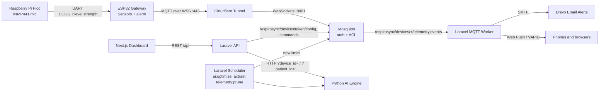

# 🫁 RespiroSync: AI-Powered Asthma Monitoring System


 
 
 


**RespiroSync** is a full-stack IoT asthma-monitoring platform. A small device in each child's room (ESP32 + Raspberry Pi Pico) measures dust, gas, temperature and humidity and listens for coughing; it sends everything over authenticated, encrypted MQTT to a Next.js / Laravel dashboard, where parents, grandparents or a doctor can follow the children they have been given access to. An AI learns what is normal for each room and what tends to precede each child's flare-ups, and may tighten the room's alarm limits, never loosen them past what the parent set.

---

## 👪 How it is organised

- **Children** (patients): only a display name is stored. An account starts with one child, renamed in *Account Settings → Children & rooms*; add more there.
- **Rooms**: one RespiroSync device per room. A room belongs to one child, or is a **shared room** (coughs there are shown and alerted, but never counted for any child). Each room has its own alarm limits.
- **Sharing**: an owner invites someone by email to one child as **owner** (everything), **caregiver** (sees everything, gets alerts, logs doses, reviews coughs) or **viewer** (sees only). The invitation link works once, for that email, for 7 days. Removing someone takes effect immediately.
- **Room picker**: the dashboard shows one room at a time; live values, Sleep Mode, cough history, Smart Alerts and the AI panel all follow it.

---

## 📸 Dashboard Interface

Responsive, dark-mode dashboard for parents and other caregivers: live readings per room, cough history, medication log, alarm limits, a printable weekly Activity Log per child.


---

## 🚀 Key Features & Technologies

| Feature | Technology Used | Description |
|---|---|---|
| **Acoustic cough detection** | `Raspberry Pi Pico` | INMP441 I2S microphone. A sound-level heuristic flags short loud bursts and reports a 0–1 *detection strength*. It cannot yet tell a cough from other loud sounds (see `hardware/README.md`, Phase 2). |
| **Environmental telemetry** | `ESP32` | DHT22 (temperature/humidity), MQ-135 (gas, estimated CO₂-equivalent ppm, self-calibrated), Sharp GP2Y1010AU0F (dust, self-calibrated estimate). Sent every 3 s, smoothed over ~12 s. Local passive-buzzer/LED alarm when a reading crosses its limit, even offline. |
| **Secure IoT transport** | `Mosquitto + Cloudflare Tunnel` | MQTT over WSS. No anonymous access; each device can only publish/subscribe under its own token (broker ACL). |
| **AI, two levels** | `Python / scikit-learn` | A **room model per device** learns what is normal for that room (dust, temperature, humidity, gas) and flags readings that are unusual for it (Stage 1). A **risk model per child**, once about two flare-ups are recorded, learns from that child's rooms what precedes a rescue dose or a cough cluster in the next hour (Stage 2: logistic regression, then Random Forest), using window averages, how fast dust and humidity are rising, night-time, coughs and the daily-dose input; it is evaluated by recall and precision on later data. Caregiver "false alarm" marks are excluded from training. |
| **Alarm limits** | `Laravel scheduler` | The value a parent sets is a **cap**: the AI may lower a room's limit toward what is usual for that room, never raise it above the cap, at most once a day by up to 10 %, and only after 24 h of readings. Any limit can be **locked**. A documented rule (not AI) lowers limits 15 % while a child's daily inhaler dose is missed. Every change is logged with its reason. |
| **Alerts** | `Brevo SMTP + Web Push` | Email and phone/browser push when coughs cluster (3 in 10 min, or 2 strong detections), at most one per room per 10 minutes, to every member of the child with alerts on. The push names the room and child and opens that room. iPhone: add the dashboard to the Home Screen first (iOS 16.4+). |
| **Privacy (PDPA)** | `Laravel` | One central access check (policies per role); a stranger gets 404 for any id. Each child's data downloads as CSV. Deleting a room, a child or an account deletes their records and the AI models trained on them. Sensor readings: every reading for 7 days, then 10-minute averages, deleted after a year. Audit log of sharing and changes. |
| **REST API & workers** | `Laravel 12 / PHP 8.2` | API, MQTT worker, scheduler (`ai:optimize` every 5 min, `ai:train` every 4 h, `telemetry:prune` nightly). |
| **Interactive UI** | `Next.js / Tailwind CSS` | Room picker, live monitor, Sleep Mode, Smart Alerts per room, Children & rooms, sharing, a weekly Activity Log per child (printable, with data downloads). |
| **Identity** | `Laravel Sanctum` | Token auth, forgot/reset password (links expire after 60 minutes). |

---

## 🧠 System Architecture



The AI engine keeps a room model per device and a risk model per child; the backend checks access before every call, and the engine is only reachable inside the Docker network.

### MQTT topics

| Topic | Direction | Payload |
|---|---|---|
| `respirosync/devices/<token>/telemetry` | device → cloud | `{"pm25_level":12.3,"temperature":29.1,"humidity":70,"mq135_level":410}` (`null` for a failed sensor) |
| `respirosync/devices/<token>/events` | device → cloud | `{"event":"cough","level":2,"confidence":0.42}` (`confidence` = Pico detection strength) |
| `respirosync/devices/<token>/config` | cloud → device (retained) | `{"pm25_threshold":35,"temperature_threshold":35,"humidity_threshold":75,"mq135_threshold":1000,"is_buzzer_muted":false}` (that room's limits) |
| `respirosync/devices/<token>/commands` | cloud → device | `{"command":"factory_reset"}`, `buzzer_on`, `buzzer_off` |

The device connects with **client id = its 6-character token**; `mosquitto/config/acl` restricts it to its own four topics.

---

## 📁 Repository Structure

```text
asthma-monitoring-system/
├── frontend/               # Next.js application (port 3000, published on 127.0.0.1:3005)
├── backend/                # Laravel 12 API, MQTT worker, scheduler (port 8000 → 127.0.0.1:8005)
│   └── tests/              # PHPUnit tests (in-memory SQLite)
├── ai_engine/              # Python FastAPI + scikit-learn service (127.0.0.1:8010)
├── hardware/               # ESP32 and Pico firmware (Arduino), wiring guide
├── mosquitto/config/       # mosquitto.conf + acl (passwd is created on the server, never committed)
├── docs/                   # project explanation and operations guide
├── .github/workflows/      # CI: backend tests, MySQL migrations, frontend build, AI checks, firmware compiles
├── .env.example            # docker-compose variables
└── docker-compose.yaml
```

**Documentation**

| Document | What it covers |
|---|---|
| [`docs/PROJECT_EXPLANATION.md`](docs/PROJECT_EXPLANATION.md) | How each component works, the alert rule and the AI, with their limits |
| [`docs/OPERATIONS.md`](docs/OPERATIONS.md) | Health checks, backups, resets, device factory reset, scheduled tasks, testing alerts, running the tests |
| [`docs/DEMO.md`](docs/DEMO.md) | A 12-minute demo script, with commands to trigger the slow alerts on the spot |
| [`docs/DIAGRAMS.md`](docs/DIAGRAMS.md) | Architecture, alert, AI, device and LCD diagrams (Mermaid) for the report and slides |
| [`hardware/README.md`](hardware/README.md) | Firmware setup and the edge cough-classifier roadmap |
| [`hardware/WIRING_GUIDE.md`](hardware/WIRING_GUIDE.md) | Pin-by-pin wiring, including the voltage dividers |

---

## 🌍 Infrastructure & Hosting Architecture

**Reference deployment:** UGREEN NAS DXP4800 Plus running the UGOS Pro Docker app. A Cloudflare Tunnel publishes the dashboard and the broker's WebSocket listener, so no router ports are opened. A cron job on the NAS pulls this repository and rebuilds the containers.

---

## 🛠️ Deployment (Docker)

1. **Clone and configure**
   ```bash
   git clone https://github.com/anake-an/asthma-monitoring-system.git
   cd asthma-monitoring-system
   cp .env.example .env                 # fill in DB, mail, MQTT and Cloudflare values
   cp backend/.env.example backend/.env
   ```
   In `backend/.env`, set **`FRONTEND_URL`** to the exact address the dashboard is served at (the links in invitation, password-reset and alert emails use it), and **`VAPID_SUBJECT`** to a `mailto:` address you read (iPhones reject pushes without it).

2. **Broker credentials** (once per server; the broker will not start without them)
   ```bash
   # generate two strong passwords, e.g. with: openssl rand -base64 24
   docker run --rm -v "$PWD/mosquitto/config:/mosquitto/config" eclipse-mosquitto:2.0 \
     mosquitto_passwd -c -b /mosquitto/config/passwd respirosync_backend 'BACKEND_PASSWORD'
   docker run --rm -v "$PWD/mosquitto/config:/mosquitto/config" eclipse-mosquitto:2.0 \
     mosquitto_passwd -b /mosquitto/config/passwd respirosync_device 'DEVICE_PASSWORD'
   sudo chown 1883:1883 mosquitto/config/passwd && sudo chmod 600 mosquitto/config/passwd
   ```
   Put `BACKEND_PASSWORD` in `.env` as `MQTT_PASSWORD`, and `DEVICE_PASSWORD` in the firmware's `secrets.h`.

3. **Boot**
   ```bash
   docker compose up -d --build
   docker compose exec backend php artisan key:generate   # first install only
   docker compose exec backend php artisan webpush:vapid  # first install only: push notification keys
   ```
   The backend runs `php artisan migrate --force` on every start, so schema changes apply automatically on deploy. The AI trains every 4 hours; to train right away (e.g. after an hour of readings from a new device, or after resetting the AI), run `docker compose exec backend php artisan ai:train`. Upgrading from an older release: read its *Upgrading* notes in [`CHANGELOG.md`](CHANGELOG.md).

4. **Run the tests** (in-memory SQLite). **Never run them inside the running `backend` container.**
   Docker sets `DB_CONNECTION=mysql` there, which overrides `phpunit.xml`, and `RefreshDatabase` would drop every table in the live database. `tests/TestCase.php` refuses to start unless the connection is in-memory SQLite, but don't rely on that alone.
   On a development machine:
   ```bash
   cd backend && php artisan test
   ```
   On the server, use a throwaway container with no network (it cannot reach MySQL even by mistake):
   ```bash
   docker run --rm --network none -v "$PWD/backend:/app" -w /app webdevops/php:8.2-alpine php artisan test
   ```

The dashboard is served on `127.0.0.1:3005` and published through the Cloudflare Tunnel.

## ⚡ Hardware Setup

1. Wire everything as described in `hardware/WIRING_GUIDE.md` (note the voltage dividers on the two 5 V analog sensors).
2. Flash `hardware/pico_cough_ai/pico_cough_ai.ino` to the Pico using the **arduino-pico** core ("Raspberry Pi Pico/RP2040" by Earle Philhower).
3. Copy `hardware/esp32_firmware/secrets.example.h` to `secrets.h`, fill in the broker URL and device password, then flash `esp32_firmware.ino` to the ESP32.
4. In the dashboard, open *Account Settings → Children & rooms*, choose the child the room is for and click **Pair New ESP32 Device**; connect your phone to the **RespiroSync-Setup** Wi-Fi hotspot and enter the Wi-Fi details and the token. Then give the room a name (e.g. "Bedroom") in the same place.

> [!WARNING]
> **Hardware Liability Disclaimer:** 
> The wiring guide provided is a **reference implementation** only. Because ESP32 and sensor modules vary wildly by manufacturer, you should *never* blindly follow the wiring diagrams. Always double-check your specific manufacturer datasheets for pinouts, voltages (5V vs 3.3V), and common grounds before powering on the system. We are not responsible for any fried boards, short circuits, or damaged components. Proceed at your own risk.

---

## 📄 License & Medical Disclaimer

This project is licensed under the **GNU General Public License v3.0 (GPLv3)**; see [`LICENSE`](LICENSE) for the exact terms.
*   You may use, study, modify and share it, for academic, personal or commercial purposes.
*   If you **distribute** it or a modified version (for example, ship it on devices or publish a fork), you must license that work under GPLv3 too and make its source code available to the people you distribute it to.
*   This summary is not legal advice; the `LICENSE` file is what applies.

Security issues: please report them privately, as described in [`SECURITY.md`](SECURITY.md). Release history: [`CHANGELOG.md`](CHANGELOG.md).

**MEDICAL DISCLAIMER:** RespiroSync is a student prototype. It is **not** a registered medical device (in Malaysia, medical devices are regulated by the Medical Device Authority under the Medical Device Act 2012, Act 737) and it has not been clinically validated. Its cough detection is a loudness heuristic, and its sensor readings and AI outputs can be wrong. It must **never** replace professional medical advice, diagnosis, treatment, or emergency services.
