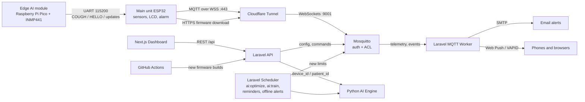

# 🫁 RespiroSync: AI-Powered Asthma Monitoring System


**RespiroSync** is a full-stack IoT asthma-monitoring platform for children. The **RespiroSync Room Monitor** (model RS-100) sits in the child's room: an ESP32 measures dust, gas, temperature and humidity, and an **Edge AI** module (Raspberry Pi Pico with an INMP441 microphone) listens for coughing on the device itself. Everything travels over authenticated, encrypted MQTT to a Next.js / Laravel dashboard, where parents, grandparents or a doctor follow the children they have been given access to.

An AI learns what is normal for each room and what tends to come before each child's flare-ups. It may tighten the room's alarm limits, but never loosens them past what the parent set. Both chips in the device are updated over the air from the dashboard.

---

## 👪 How it is organised

- **Children:** only a display name and a badge (a colour and an emoji or initial) are stored, never a photo. Children are managed in *Account Settings → Children & rooms*.
- **Rooms:** one Room Monitor per room. A room belongs to one child, or is a **shared room** (coughs there are shown and alerted, but never counted for any child). Each room has its own alarm limits.
- **Sharing:** an owner invites someone by email to one child as **owner** (everything), **caregiver** (sees everything, gets alerts, logs doses, reviews coughs) or **viewer** (sees only). The invitation link works once, for that email, for 7 days. Removing someone takes effect immediately.
- **Room picker:** the dashboard shows one room at a time. Live values, Sleep Mode, the cough history, Smart Alerts and the AI panel all follow it.
- **Accounts:** each person can add a profile photo, which the people they share a child with see.

---

## 📸 Dashboard Interface

A responsive dashboard in light and dark mode: live readings per room, the AI panel, cough history with reviews, the medication log, alarm limits, firmware updates, and a weekly Activity Log per child that prints or shares as a PDF.


---

## 📟 The Room Monitor (RS-100)

| Part | Chip | What it does |
|---|---|---|
| **Main unit** | `ESP32` | Reads the DHT22 (temperature, humidity), the MQ-135 (gas, estimated CO₂-equivalent ppm) and the Sharp dust sensor every 3 s, smoothed over about 12 s. Sounds a passive buzzer and lights a red LED when a reading crosses its limit, even without the internet. Connects to the cloud over Wi-Fi (set up from a phone through the **RespiroSync-Setup** hotspot). |
| **Edge AI module** | `Raspberry Pi Pico` + `INMP441` | Listens through an I2S microphone and detects cough-like bursts on the device itself, with a 0-1 detection strength. Only events leave the device, never audio. |
| **Display** | `16×2 LCD` | Every line centred. Start-up steps (Wi-Fi, clock, cloud), then pages every 5 s: **Air quality**, **Room climate**, the clock, and **Daily dose?** when a dose is overdue. Alerts and coughs take over the screen. **Night mode** turns the backlight off from 9 pm to 7 am (switchable per room). |
| **Power** | DC adapter + USB | A 9 V adapter on the breadboard supply feeds the sensors and LCD. USB feeds the ESP32, which also powers the Pico. |

**Firmware versions** read like real devices, for example `3.3.0 Build 261010.9`, with full histories in [`hardware/FIRMWARE_HISTORY.md`](hardware/FIRMWARE_HISTORY.md). The device firmware and the Edge AI module have their own versions, separate from the website.

---

## 🚀 Key Features & Technologies

| Feature | Technology | Description |
|---|---|---|
| **Cough detection at the edge** | `Raspberry Pi Pico` | The Edge AI module measures each 16 ms of sound and reports bursts that last at least 32 ms, with a detection strength. Electrical noise is filtered out (data line pulled down, 3 s settle at start-up). |
| **Environmental telemetry** | `ESP32` | Dust, gas, temperature and humidity every 3 s. The gas and dust sensors calibrate themselves against the cleanest air they see, and the gas sensor warms up for 3 minutes before it is read. |
| **Secure IoT transport** | `Mosquitto + Cloudflare Tunnel` | MQTT over WSS. No anonymous access. Each device can only use the topics of its own token (broker ACL). |
| **AI, two levels** | `Python / scikit-learn` | A **room model per device** learns what is normal for that room and flags unusual readings (Stage 1). A **risk model per child**, once about two flare-ups are recorded, learns what comes before a rescue dose or a cough cluster in the next hour and shows a percentage (Stage 2: logistic regression, then Random Forest). It uses window averages, how fast dust and humidity are rising, night-time, coughs and the daily dose, and it is evaluated by recall and precision on later data. Coughs reviewed as false alarms are left out of training. |
| **Alarm limits** | `Laravel scheduler` | The value a parent sets is a **cap**. The AI may lower a room's limit toward what is usual for that room, never above the cap, at most once a day by up to 10 %, and only after 24 h of readings. Any limit can be **locked**. A documented rule (not AI) lowers limits 15 % while a daily inhaler dose is missed. Every change is logged with its reason. |
| **Alerts** | `Brevo SMTP + Web Push` | Email and phone push to every member of the child with alerts on, for: **coughs** that cluster (3 in 10 minutes, or 2 strong ones), a **reading over its limit for 5 minutes**, and a **device offline for 30 minutes** (with a "back online" push). The push names the room and child and opens that room. iPhone: add the dashboard to the Home Screen (iOS 16.4+). |
| **Cough review** | `Next.js / Laravel` | Each cough can be marked **Inhaler** (logs an emergency dose at the cough's time), **Real cough** or **False alarm**, and changed later. False alarms are left out of the report, the banner, the alert rule and the AI. |
| **Medication** | `Next.js / Laravel` | Emergency (blue) and daily (brown) inhaler doses per child. Two emergency doses within 4 hours show a warning. A "Daily dose?" reminder appears on the device when the daily dose is overdue. |
| **Over-the-air updates** | `ESP32 OTA + UART` | Owners see "Update available" and press **Update**. The ESP32 downloads its own firmware over HTTPS (one-time link, SHA-256 check) and goes back to the previous version if the new one cannot reach the cloud. It also passes **Edge AI** updates on to the Pico over the UART link, in checked frames. GitHub Actions builds and publishes every new firmware automatically. |
| **Activity Log** | `Next.js` | A weekly report per child: summary cards, a 7-day chart, alert limit changes and notes. It prints on a computer, and in the iPhone app it shares as a PDF (Print, Files, Mail). |
| **Privacy (PDPA)** | `Laravel` | One central access check per role. A stranger gets 404 for any id. Each child's data downloads as CSV. Deleting a room, a child or an account deletes their records and the AI models trained on them. Readings are kept in full for 7 days, then as 10-minute averages, and deleted after a year. An audit log records sharing and changes. |
| **REST API & workers** | `Laravel 12 / PHP 8.2` | API, MQTT worker and scheduler: `ai:optimize` and the dose reminders and offline alerts every 5 minutes, `ai:train` every 4 hours, `telemetry:prune` nightly. |
| **Identity** | `Laravel Sanctum` | Token auth, forgot / reset password (links expire after 60 minutes), profile photos. |

---

## 🧠 System Architecture



The AI engine keeps a room model per device and a risk model per child. The backend checks access before every call, and the engine is only reachable inside the Docker network.

### MQTT topics

| Topic | Direction | Payload |
|---|---|---|
| `respirosync/devices/<token>/telemetry` | device → cloud | `{"pm25_level":12.3,"temperature":29.1,"humidity":70,"mq135_level":410}` (`null` for a failed or warming sensor) |
| `respirosync/devices/<token>/events` | device → cloud | `{"event":"cough","level":2,"confidence":0.42}`, `hello` (firmware and Edge AI versions), `time_request`, `ota` (update result) |
| `respirosync/devices/<token>/config` | cloud → device (retained) | the room's limits, `is_buzzer_muted`, `night_mode`, `dose_due` |
| `respirosync/devices/<token>/commands` | cloud → device | `factory_reset`, `buzzer_on`, `buzzer_off`, `set_time`, `ota` (for the ESP32 or the Edge AI module) |

The device connects with **client id = its 6-character token**, and `mosquitto/config/acl` restricts it to its own four topics.

---

## 📁 Repository Structure

```text
asthma-monitoring-system/
├── frontend/               # Next.js application (port 3000, published on 127.0.0.1:3005)
├── backend/                # Laravel 12 API, MQTT worker, scheduler (port 8000 → 127.0.0.1:8005)
│   └── tests/              # PHPUnit tests (in-memory SQLite)
├── ai_engine/              # Python FastAPI + scikit-learn service (127.0.0.1:8010)
├── hardware/
│   ├── esp32_firmware/     # main unit firmware (WHATS_NEW.txt for owners)
│   ├── pico_cough_ai/      # Edge AI module firmware (WHATS_NEW.txt for owners)
│   ├── FIRMWARE_HISTORY.md # versions of both chips
│   └── WIRING_GUIDE.md     # pin-by-pin wiring and power
├── mosquitto/config/       # mosquitto.conf + acl (passwd is created on the server, never committed)
├── docs/                   # project explanation, operations, demo script, diagrams
├── .github/workflows/      # CI: tests, MySQL migrations, frontend build, AI checks, firmware compiles and publishing
├── .env.example            # docker-compose variables
└── docker-compose.yaml
```

**Documentation**

| Document | What it covers |
|---|---|
| [`docs/PROJECT_EXPLANATION.md`](docs/PROJECT_EXPLANATION.md) | How each component works, the alert rules and the AI, with their limits |
| [`docs/OPERATIONS.md`](docs/OPERATIONS.md) | Health checks, backups, resets, scheduled tasks, testing alerts, publishing firmware, running the tests |
| [`docs/DEMO.md`](docs/DEMO.md) | A 12-minute demo script, with commands to trigger the slow alerts on the spot |
| [`docs/DIAGRAMS.md`](docs/DIAGRAMS.md) | Architecture, alert, AI, device and LCD diagrams (Mermaid) for the report and slides |
| [`hardware/README.md`](hardware/README.md) | Firmware setup, cloud updates for both chips, and the Edge Impulse roadmap |
| [`hardware/WIRING_GUIDE.md`](hardware/WIRING_GUIDE.md) | Pin-by-pin wiring, power and bring-up order |
| [`hardware/FIRMWARE_HISTORY.md`](hardware/FIRMWARE_HISTORY.md) | Every firmware version of the main unit and the Edge AI module |

---

## 🌍 Infrastructure & Hosting

**Reference deployment:** a UGREEN NAS DXP4800 Plus running the UGOS Pro Docker app. A Cloudflare Tunnel publishes the dashboard and the broker's WebSocket listener, so no router ports are opened. A cron job on the NAS pulls this repository every 5 minutes and rebuilds what changed. New firmware arrives separately: GitHub Actions builds it and uploads it to the server.

---

## 🛠️ Deployment (Docker)

1. **Clone and configure**
   ```bash
   git clone https://github.com/anake-an/asthma-monitoring-system.git
   cd asthma-monitoring-system
   cp .env.example .env                 # fill in DB, mail, MQTT and Cloudflare values
   cp backend/.env.example backend/.env
   ```
   In `backend/.env`, set **`FRONTEND_URL`** to the exact address the dashboard is served at (invitation, password-reset and alert emails link to it), **`VAPID_SUBJECT`** to a `mailto:` address you read (iPhones reject pushes without it), and **`FIRMWARE_UPLOAD_TOKEN`** to a long random value if GitHub Actions should publish firmware.

2. **Broker credentials** (once per server, the broker will not start without them)
   ```bash
   # generate two strong passwords, e.g. with: openssl rand -base64 24
   docker run --rm -v "$PWD/mosquitto/config:/mosquitto/config" eclipse-mosquitto:2.0 \
     mosquitto_passwd -c -b /mosquitto/config/passwd respirosync_backend 'BACKEND_PASSWORD'
   docker run --rm -v "$PWD/mosquitto/config:/mosquitto/config" eclipse-mosquitto:2.0 \
     mosquitto_passwd -b /mosquitto/config/passwd respirosync_device 'DEVICE_PASSWORD'
   sudo chown 1883:1883 mosquitto/config/passwd && sudo chmod 600 mosquitto/config/passwd
   ```
   Put `BACKEND_PASSWORD` in `.env` as `MQTT_PASSWORD`, and `DEVICE_PASSWORD` in the firmware's `secrets.h`.

3. **Boot**
   ```bash
   docker compose up -d --build
   docker compose exec backend php artisan key:generate   # first install only
   docker compose exec backend php artisan webpush:vapid  # first install only: push notification keys
   ```
   The backend runs `php artisan migrate --force` on every start, so schema changes apply by themselves. The AI trains every 4 hours. To train right away, run `docker compose exec backend php artisan ai:train`. When upgrading, read the release's *Upgrading* notes in [`CHANGELOG.md`](CHANGELOG.md).

4. **Automatic firmware publishing** (optional): add the GitHub secrets `MQTT_URI`, `MQTT_USERNAME`, `MQTT_PASSWORD`, `FIRMWARE_UPLOAD_URL` and `FIRMWARE_UPLOAD_TOKEN`. Then every firmware change merged to `main` reaches owners as an update. Details in [`hardware/README.md`](hardware/README.md).

5. **Run the tests** (in-memory SQLite). **Never run them inside the running `backend` container.**
   Docker sets `DB_CONNECTION=mysql` there, which overrides `phpunit.xml`, and `RefreshDatabase` would drop every table in the live database. `tests/TestCase.php` refuses to start unless the connection is in-memory SQLite, but don't rely on that alone.
   On a development machine:
   ```bash
   cd backend && php artisan test
   ```
   On the server, use a throwaway container with no network (it cannot reach MySQL even by mistake):
   ```bash
   docker run --rm --network none -v "$PWD/backend:/app" -w /app webdevops/php:8.2-alpine php artisan test
   ```

The dashboard is served on `127.0.0.1:3005` and published through the Cloudflare Tunnel.

## ⚡ Hardware Setup

1. Wire everything as described in [`hardware/WIRING_GUIDE.md`](hardware/WIRING_GUIDE.md): the 9 V DC adapter for the sensors and LCD, USB for the ESP32 (which powers the Pico), and the voltage dividers on the two 5 V analog sensors.
2. Flash `hardware/pico_cough_ai/pico_cough_ai.ino` to the Pico with the **arduino-pico** core and **Flash Size "2MB (Sketch: 1MB, FS: 1MB)"**.
3. Copy `hardware/esp32_firmware/secrets.example.h` to `secrets.h`, fill in the broker URL and device password, and flash `esp32_firmware.ino` with **Partition Scheme "Minimal SPIFFS (1.9MB APP with OTA)"**.
4. In the dashboard, open *Account Settings → Children & rooms*, choose the child the room is for and click **Pair New ESP32 Device**. Connect your phone to the **RespiroSync-Setup** Wi-Fi hotspot and enter the Wi-Fi details and the token. Then give the room a name (for example "Bedroom").
5. From then on, both chips are updated from the dashboard: *Account Settings → Rooms → Update*.

> [!WARNING]
> **Hardware Liability Disclaimer:**
> The wiring guide is a **reference implementation** only. ESP32 and sensor modules vary by manufacturer, so never follow the wiring blindly. Check your own datasheets for pinouts, voltages (5 V vs 3.3 V) and common grounds before powering on. We are not responsible for fried boards, short circuits or damaged components. Proceed at your own risk.

---

## 🗺️ Roadmap

- **Edge Impulse cough classifier:** a trained model on the Edge AI module that tells a cough from a door slam, a clap or a shout. It will ship to devices as an Edge AI update from the dashboard, with no change to the hardware.

---

## 📄 License & Medical Disclaimer

This project is licensed under the **GNU General Public License v3.0 (GPLv3)**. See [`LICENSE`](LICENSE) for the exact terms.
*   You may use, study, modify and share it, for academic, personal or commercial purposes.
*   If you **distribute** it or a modified version (for example, ship it on devices or publish a fork), you must license that work under GPLv3 too and make its source code available to the people you distribute it to.
*   This summary is not legal advice. The `LICENSE` file is what applies.

Security issues: please report them privately, as described in [`SECURITY.md`](SECURITY.md). Release history: [`CHANGELOG.md`](CHANGELOG.md).

**MEDICAL DISCLAIMER:** RespiroSync is a student prototype. It is **not** a registered medical device (in Malaysia, medical devices are regulated by the Medical Device Authority under the Medical Device Act 2012, Act 737), and it has not been clinically validated. Its cough detection reacts to loud cough-like sounds, and its sensor readings and AI outputs can be wrong. It must **never** replace professional medical advice, diagnosis, treatment or emergency services.
