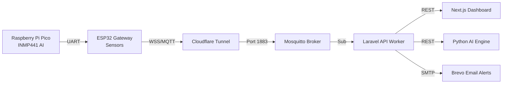

# 🫁 RespiroSync: AI-Powered Asthma Monitoring System


 
 
 


**RespiroSync** is a professional, full-stack IoT medical telemetry platform. It utilizes a Dual-Processor Hardware Architecture (ESP32 + Raspberry Pi Pico) to perform acoustic AI cough detection and environmental monitoring at the edge, beaming data securely to a Next.js / Laravel cloud dashboard.

---

## 📸 Dashboard Interface

The cloud platform features a responsive, dark-mode native dashboard designed for guardians and medical professionals to monitor patient vitals, configure hardware thresholds, and generate PDF analytics reports.


---

## 🚀 Key Features & Technologies

| Feature | Technology Used | Description |
|---|---|---|
| **Edge Acoustic AI** | `Raspberry Pi Pico` | High-speed I2S microphone (INMP441) sampling and energy-heuristic algorithms to detect human coughs with confidence scoring. |
| **Environmental Telemetry** | `ESP32` | Polls DHT22 (Temp/Hum), MQ-135 (Gas), and Sharp Dust (PM2.5) sensors. |
| **Secure IoT Transport** | `Cloudflare WebSockets` | Bi-directional WSS (Secure WebSockets) payload delivery bypassing home router NATs. |
| **Predictive AI Engine** | `Python / scikit-learn` | Dedicated Python microservice running Random Forest models to detect abnormal breathing patterns. |
| **REST API & Workers** | `Laravel 11 / PHP 8.2` | Manages device authentication, token issuance, and background MQTT worker daemons. |
| **Interactive UI** | `Next.js / Tailwind CSS` | Real-time React frontend with interactive Recharts, Sleep Mode, and Command Center. |
| **Emergency Alerts** | `Brevo SMTP / Push` | Automated, intelligent anti-spam dispatch of clinical HTML emails and Web Push notifications. |
| **Identity Management** | `Laravel Sanctum` | Secure multi-tenant authentication with tokenized forgot/reset password flows. |

---

## 🧠 System Architecture



---

## 📁 Repository Structure

```text
asthma-monitoring-system/
├── frontend/               # Next.js Application (Port 3000)
├── backend/                # Laravel API Application (Port 8000)
├── ai_engine/              # Python Machine Learning Microservice (Port 5000)
├── hardware/               # ESP32 and Pico Firmware (C++)
├── mosquitto/              # MQTT Broker Configuration (Port 1883)
└── docker-compose.yaml     # Orchestrates all 5 microservices
```

---

## 🌍 Infrastructure & Hosting Architecture

The backend infrastructure of RespiroSync is optimized to run on high-availability, low-power Edge/Home Servers rather than expensive public cloud instances. 

**Our Reference Deployment:**
*   **Hardware Host:** Ugreen NAS DXP4800 Plus
*   **Container Engine:** UGOS Pro Docker App
*   **Zero-Trust Networking:** The NAS exposes the Mosquitto Broker and Next.js frontend to the public internet securely using **Cloudflare Tunnels**. This eliminates the need to open dangerous ports on the local home router while ensuring all WebSockets traffic (WSS) from the ESP32 is encrypted end-to-end.
*   **Automated Deployments:** A `crontab` job runs securely on the NAS to automatically `git pull` updates from this repository and rebuild the 5 Docker containers seamlessly.

---

## 🛠️ Deployment (Docker)

To deploy the entire cloud infrastructure on a Linux VPS or Synology NAS:

1. **Clone the repository:**
   ```bash
   git clone https://github.com/anake-an/asthma-monitoring-system.git
   cd asthma-monitoring-system
   ```

2. **Boot the Cloud Environment:**
   ```bash
   docker compose up -d --build
   ```

3. **Initialize the Database:**
   Wait 15 seconds for MySQL to boot, then run:
   ```bash
   docker compose exec backend php artisan migrate:fresh --seed
   ```

The dashboard will now be accessible at `http://YOUR_SERVER_IP:3000`.

## ⚡ Hardware Setup

To assemble and flash the physical hardware unit:
1. Navigate to the `hardware/` directory.
2. Read `WIRING_GUIDE.md` for exact pinout instructions.
3. Flash `hardware/pico_cough_ai/pico_cough_ai.ino` to the Raspberry Pi Pico.
4. Rename `hardware/esp32_firmware/esp32_firmware.example.ino` to `esp32_firmware.ino` and flash it to the ESP32.
5. Connect your phone to the "RespiroSync-Setup" WiFi hotspot to input your Dashboard Device Token!

> [!WARNING]
> **Hardware Liability Disclaimer:** 
> The wiring guide provided is a **reference implementation** only. Because ESP32 and sensor modules vary wildly by manufacturer, you should *never* blindly follow the wiring diagrams. Always double-check your specific manufacturer datasheets for pinouts, voltages (5V vs 3.3V), and common grounds before powering on the system. We are not responsible for any fried boards, short circuits, or damaged components. Proceed at your own risk.

---

## 📄 License & Medical Disclaimer

This project is open-sourced under the **GNU General Public License v3.0 (GPLv3)**. 
*   **Students & Hobbyists:** You are free to use, modify, and distribute this software for academic and personal projects.
*   **Commercial Entities:** If you use or modify this codebase in any commercial product, you are legally required to open-source your entire proprietary codebase under the same GPLv3 license.

**DISCLAIMER:** RespiroSync is an educational/prototyping project. The AI models and sensor readings are not FDA-approved and should **never** be used as a replacement for professional medical advice, diagnosis, or emergency services.
