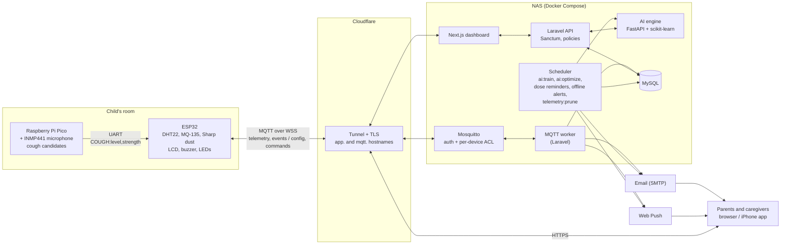
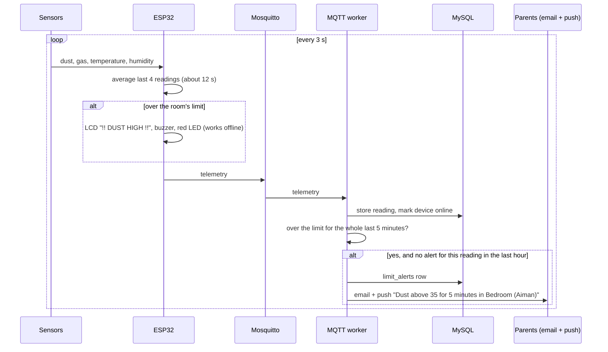
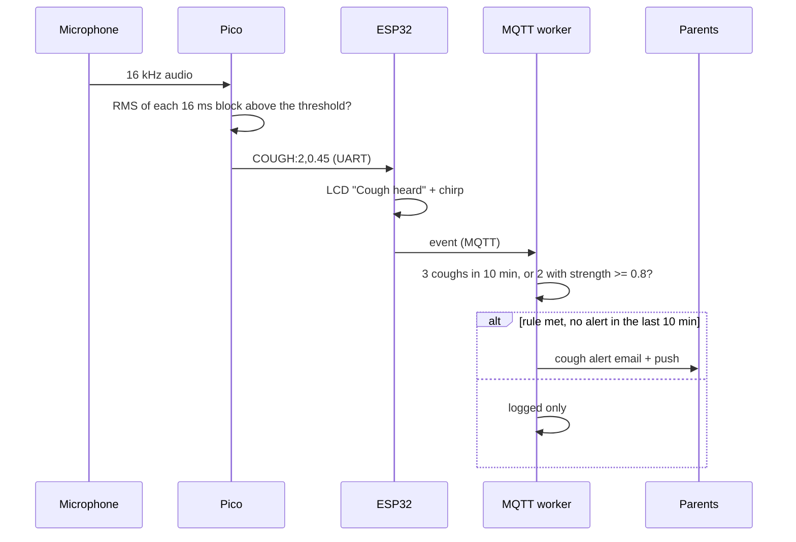
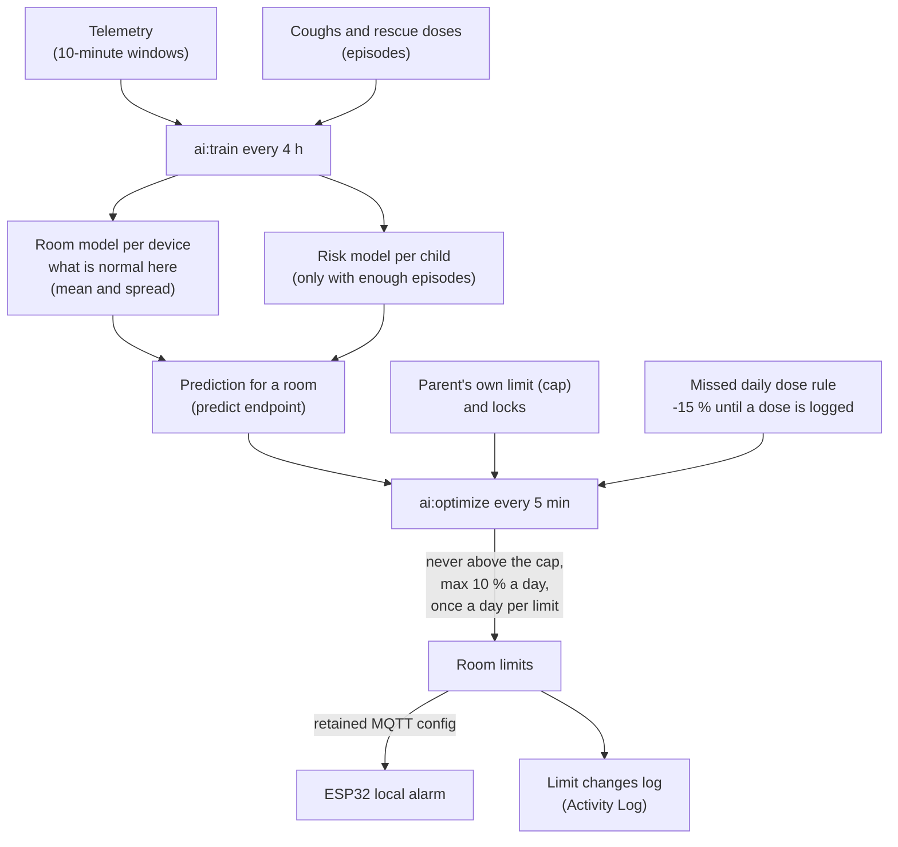
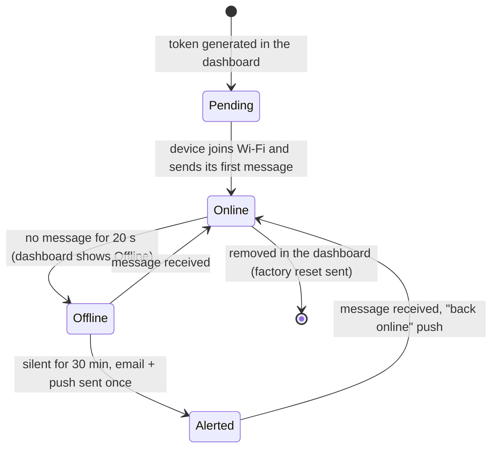
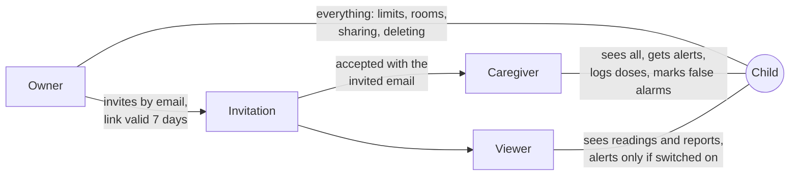
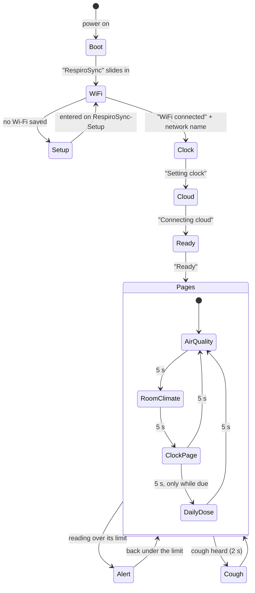

# RespiroSync diagrams

Diagrams for the report and slides. GitHub draws them from the Mermaid code below. To get an image, open this file on GitHub and take a screenshot, or paste a block into [mermaid.live](https://mermaid.live) and export it as PNG or SVG.

---

## 1. System architecture

---

## 2. A reading over its limit (local alarm and alert)

---

## 3. A cough (detection and alert rule)

---

## 4. How the AI learns and changes limits

---

## 5. Device life cycle

---

## 6. Sharing a child (roles)

---

## 7. LCD screens

